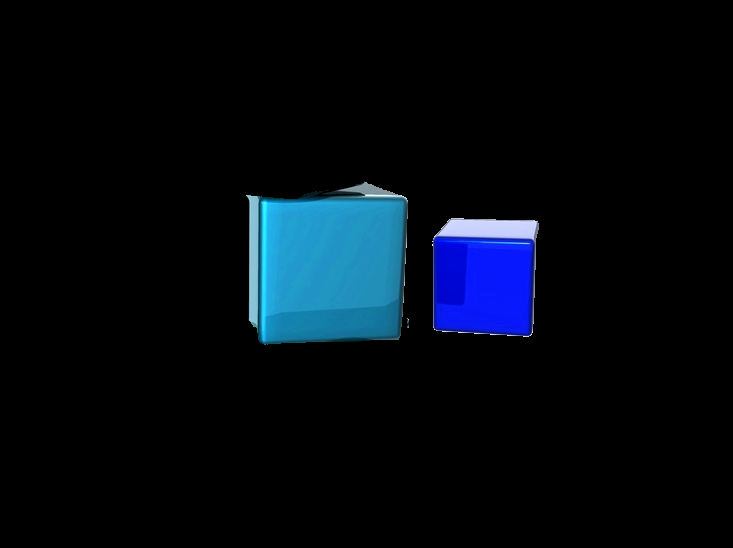

##
# Задание

Разработать приложение для обнаружения на фото синего кубика.
# Решение

`	`Для реализации данной задачи выбрал библиотеку алгоритмов компьютерного зрения, обработки изображений и численных алгоритмов общего назначения с открытым кодом – OpenCV, реализованную на языке Python. 

Примерный алгоритм обнаружения на фото синего кубика:

- Применение маски-фильтра к фото:
    - Задается цветовой промежуток в формате HSV.
    - Все пиксели, не входящие в этот диапазон, затемняются.
    - Все пиксели, входящие в этот диапазон, остаются неизменными. 
- Прорисовка всех контуров на изображении
- Фильтрация контуров, остаются лишь следующие контуры:
  - Прямые контуры
  - Замкнутые контуры
  - Выпуклые контуры
  - Контуры, состоящие из многогранника 4 или 6 углов. 
  - Контуры, углы которых не острые
- Прорисовка оставшихся контуров на исходном изображении.
# Реализация

1. Считываем изображение

```python
path = 'picture/3.jpg'
src = cv2.imread(path)
```

2. Задаем границы фильтра-маски для цвета в формате HSV

```python
low_blue = numpy.array((90, 20, 20), numpy.uint8)
high_blue = numpy.array((140, 255, 255), numpy.uint8)
```

3. Применяем маску к изображению и выводим результат

```python
img_hsv = cv2.cvtColor(src, cv2.COLOR_BGR2HSV)
mask_blue = cv2.inRange(img_hsv, low_blue, high_blue)
result = cv2.bitwise_and(img_hsv, img_hsv, mask=mask_blue)
result = cv2.cvtColor(result, cv2.COLOR_HSV2BGR)
```

4. Получаем все контуры и фильтруем их

```python
squares = find_squares(result)
cv2.imshow('with blue color', result)
```


5. Прорисовываем контуры на изображении и выводим результат на экран
```python
cv2.drawContours(src, squares, -1, (0, 255, 0), 4)
cv2.imshow('image', src)
cv2.waitKey(0)
```

# Изображения:
Пример 1.


*Рисунок 1. Исходное изображение*



*Рисунок 2. Изображение с фильтром синего цвета*


*Рисунок 3. Готовые изображение*

Как видим в первом примере алгоритм справился довольно неплохо. Возьмем пример поинтересней:

Пример 2. 


*Рисунок 4. Исходное изображение*


*Рисунок  5. Изображение с фильтром синего цвета*


*Рисунок  6. Готовое изображение*

`	`Алгоритм справился с большинством кубиков на изображении, нераспознанные кубики закрыты другими областями и поэтому при фильтрации контуров эти контуры были отсеяны, так как не являются выпуклыми. 

# Вывод

`	`В процессе выполнения работы ближе познакомился с библиотекой OpenCV, разработанный алгоритм возможно и не идеален, но он работает и в какой-то степени справляется с задачей обнаружения синих кубиков на изображении. 
